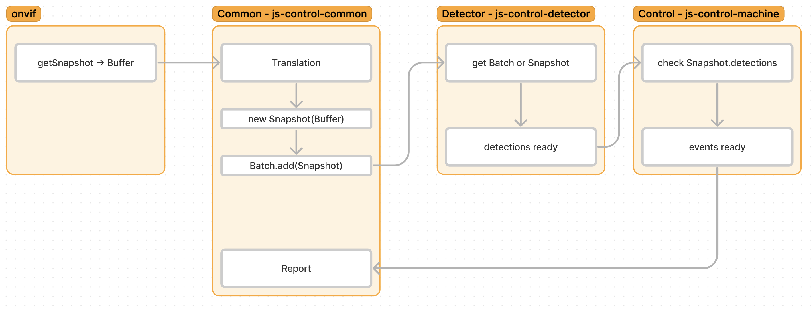

# Работа с контейнером

*Подключение по SSH к Каунасу (ноутбук HP)*

ssh admin1@7.tcp.eu.ngrok.io -p 17306

Если не подключачется - можно попробовать AnyDesk:
address: 145 479 941
password: just4Taqtile

Для доступа к https://5s-kaunas-hp.netlify.app/
email: admin
password: admin

Для отображения картинок нажать кнопку Visite Site здесь:
https://65b5-81-7-77-205.ngrok-free.app

Этот и вышеуказанный ngrok периодически обновляются, в группе должны оповещать:
tcp://7.tcp.eu.ngrok.io:17306

*Сборка и обновление удалённого билда*

Локально:
- sudo docker login или просто запустить Docker Desktop или Rancher
- username и password для аккаунта 5scontrol спросить у кого-нибудь из команды
- sudo docker build -t 5scontrol/machine_control_js:v0.1.0 . --platform=linux/amd64
- sudo docker push 5scontrol/machine_control_js:v0.1.0

Удалённо:
- подключиться по SSH к Каунасу (ноутбук HP)
- sudo docker pull 5scontrol/machine_control_js:v0.1.0
- cd /home/server/reps
- sudo docker-compose down && sudo docker-compose up

Временно до включения имеджа machine_control_js в общий билд:
sudo docker run -v /home/server/reps/images:/var/www/5scontrol/images 5scontrol/machine_control_js:v0.1.0

*Полезные команды при работе с докером*

sudo docker ps - список запущенных контейнеров
sudo docker ps -a - список всех контейнеров
sudo docker logs айди_контейнера - посмотреть логи
sudo docker stats - статистика использования ресурсов

# Модульная архитектура

У оперейшн-контрол и машин-контрол схожая модульная архитектура.

Модули:
- globals - глобальные переменные
- Translation
- Detector
- Control
- Report
- Debugger

В будущем модули Control и Detector планируется вынести в отдельные контейнеры: логика алгоритмов будет в Control, cv-модели в Detector, общие для оперейшена и машин - Common:

# Событийная система

Модули общаются между собой через диспатчер, на который можно подписаться через метод on и который генерирует событие методом emit.
Как правило, помимо события диспатчер передаёт в теле 

События трёх уровней:
- детекция - генерируется из модуля Detector
- - рабочий обнаружен
- - рабочий не обнаружен
- накопительное (EventAccumulator) - генерируется из модуля Control: когда что-то происходит подряд несколько раз - генерируется это событие.
- регион

Логика сущностей не привязана к одному языку, может быть переписана на любой язык, в том числе на Питон.

Диспатчер наследуется от нодовского EventEmitter'а, но может быть написан с нуля - это обычный паттерн обозревателя. Хороший пример - [в three.js](https://github.com/mrdoob/three.js/blob/dev/src/core/EventDispatcher.js) или [здесь](https://refactoring.guru/ru/design-patterns/observer)
